# Grow a stream

Let's speedrun building a substream!

Even if you don't know what that is, if you know how to write solidity, you know how to write (some) streamline!

But if you don't know what a substream is. Here is a 30 second explanation.

## What substream??1!!1?

The one sentence explanation is:
A substream is a program, that takes block data as it's input, and spits out exactly what you are looking for. 

Think about it like a program designed to find a needle in a haystack. Where the needle is the data you care about, and the haystack is the sea of bytes that is the blockchain.

Here is a fancy diagram of how it works:

Here is a simple flow chart:

```mermaid
graph LR;
    block["An Ethereum Block 📤 "]
    substream["Your substream ⚙"]
    output["The data you wanted!🌟"]
    block-->|Feeds into|substream;
    substream-->|Outputs|output;
```

