# Grow a stream

Let's speedrun building a Substream!

Even if you don't know what that is, if you know how to write solidity, you know how to write (some) streamline!

But if you don't know what a Substream is. Here is a 30 second explanation.

## What substream??1!!1?

The one sentence explanation is:
A Substream is a program, that takes block data as it's input, and spits out exactly what you are looking for. 

Think about it like a program designed to find a needle in a haystack. Where the needle is the data you care about, and the haystack is the sea of bytes that is the blockchain.

Here is a fancy diagram of how it works:


### So how does it work?

Well believe it or not, it isn't magic and doesn't read your mind.

However Substreams are remarkably programs under the hood.

A Substream is just a series of "modules" that take data as input, and output some other modified data.

If you have ever done any functional or data driven programming this should feel super familiar.

<details>
<summary> Does the term "functional programming" strike fear in your heart? </summary>
If the term "functional programming" strikes fear in your heart, don't worry!

This language isn't haskell!

The design decisions were made to make things as easy as possible to learn.

As well as also preventing footguns from trying to do something that isn't possible when using substreams.

So these "restrictions", will make it really hard to write something that isn't valid substreams code.

And they also heavily increase the readabillity of the code. Which you will see shortly.
</details>

# A quick primer for data driven programming

This language is data driven. What does this mean?

This means that we write code that takes some data in, and modifies or extracts something from that data and returns some new data.

So we write our programs by describing the data transformations that should take place, rather than the literal instructions on how to do that transformation.

This greatly simplifies the mental model of our code.
Because as far as we are concerned, we only need to know two concepts:

### The two things you need to know
1. Data:

   This includes the simple values that we know in solidity. Such as an address or uint256.
   
   This also includes "structured" data types we create with structs, events, arrays, and mappings. This allows us to represent more information with our data.

2. Functions:

   A function takes some input, and does something to it's input and returns something. 
   _Note: In our language, functions must ALWAYS return a value._ 
   This is because we use functions exactly like we would use values. IE they are just more data.
   
   However all functions in this language are "pure". This is exactly the same as pure functions in solidity.
   
   A pure function is just a function that only works on data provided by it's inputs, and cannot "touch" anything outside of the function.
   
These two concepts are extremely powerful and flexible. Which is why we use them as the building blocks of our programs. Let's walk through a simple example problem to highlight that.

### Example Problem in words

For this example, let's walk through how we would filter some NFT transfers, to extract the tokens that have been burnt.

In general, solving problems in a data driven fashion can be seen as three steps.

1. Clarify what data you are working with
2. Clarify the data you want to end up with
3. Describe the steps to go from input -> output

---

1. What is the data we are working with?

    Well our input is an erc721 transfer event. So that looks like this:

    ```solidity

    event Transfer(address indexed from, address indexed to, uint256 indexed tokenId);

    ```

2. What data do we want to find?

    We can define a "burn" as a transfer where the `to` address is the zero address.

    Now that we know what our output is, and we know what our input is, we can describe how to get from input->output.

3. How to get from input->output

   Here is how we can go from input->output in pseudo code.

    ```

    Given a list of Transfer Events,

    Filter the list, to only include Transfers where, Transfer.to == address(0)

    This gets us our "burns"

    ```
    
Now lets look at how we would model this problem using streamline!

### Example Problem in Streamline

1. What is the data we are working with?

   This part looks the same. We just use the event declaration to define a new structure of data.

    ```solidity

    event Transfer(address indexed from, address indexed to, uint256 indexed tokenId);

    ```

2. What data do we want to find?

    So if a burn is always to the zero address. We can represent this as a struct like so:

    ```solidity

    struct NftBurn {
        address burner;
        uint256 tokenBurnt;
    }

    ```

3. How to get from input->output

   To do this step, we will use a function to describe how to convert a list of `Transfer`s, into a list of `NftBurn`s
   
   Here is the code, and we will explain each step.
   
   ```streamline

   fn findBurns:
   (Transfer[]) -> NftBurn[] {
       filter (transfer) => transfer.to == address(0);
       map (transfer) => NftBurn {
                            burner: transfer.from,
                            tokenBurnt: transfer.tokenId,
                         };
   }

   ```

   This might look confusing, but it's super simple. Let's break it down.

   - Function declaration:

    `fn findBurns:`

    This line declares a new function called findBurns. 
    _Note: the use of fn for a data transforming function. This is because the solidity `function` keyword can actually be used as a data source in the language._
    
    - Function Signature:

    `(Transfer[]) -> NftBurn[]`

    This describes what our function does in terms of the data it operates on.

    The goal here is to allow the reader of the function, to immediately see what the function does, without worrying about the implementation details. We only care about what data goes in, and what data comes out.
    
    The things in the parens, are the input types for the function. And the thing to the right of the arrow is the output of the function.
    
    _Note: Functions can only have a single data type outputted from them. So if you want to make a function return a bunch of stuff, either split it up into sub functions. Or wrap the output in a single data type so we can reason about it easier._
    
    - Function Pipeline

    The function pipeline is meant to be read top down. Where each "line", is a function that describes a single step in the data transformation.
    
    So the output of a "step", becomes the input to the next step below it, or if it is the last step in the pipeline, it's output becomes the output value of the function.
    
    And in the case of the first step in the pipeline, it's input, is the input to the module. _The things inside the parens in the signature_
    
    This example also shows a very useful feature of this language. Combinators!
    
    A combinator, is a special function that only works on a list. 

    The combinator takes a function as an argument, and will apply that function to each element of the list. The cool thing about combinators, is they output another list. So you can "combine" your combinators to describe data transformation super simply.

    So the first combinator, `filter`, only keeps elements of the list, where the function returns true.

    In this case, we are filtering the transfers, to only include our "burns".

    ```

    filter (transfer) => transfer.to == address(0);

    ```

    Next we use another combinator, `map`, map just applies the function to each element of the list and the return value of the function, is the new value of the item in the list.
    
    ```

    map (transfer) => NftBurn {
                         burner: transfer.from,
                         tokenBurnt: transfer.tokenId,
                     };

    ```
    
    So here, we just convert each transfer in our list, which are all burns thanks to the filter, into a new data structure we defined earlier.
    
    Now the output of our function is a list of NftBurn, like we described in the declaration.
    
    If this doesn't make sense yet, just keep going. We will walk through some more examples and give some more explanations of the concepts! 

# Modules Explained

So now that you, valued reader, are a data driven programming expert. Let's go back to Substreams for a second.

So we know that Substreams take block data in, and output the data we want.

Does this sound familiar to anything we just covered? It should!

A Substream can be thought of a function from `(Block) -> OurData`.

The way that we get to `OurData` is with "modules". Modules are just like functions, in that they operate on their inputs. Modules can feed their data into other modules.

The thing that makes modules different than functions, is that a module eventually has to get data from a block. We can't have modules that aren't connected to something that isn't connected to a block.

So to summarize, every module is a step that is actually used in the transformation from a block -> our data. Whereas a function is simply an abstract description of how to go from X -> Y. They are similar, but their usage is slightly different.

Let's visualize what I mean here:

```mermaid
graph LR;
    block["An Ethereum Block 📤 "]
    module_a["Module A: Gets Transfers"]
    module_b["Module B: Filters Burns"]
    block-->|Feeds into|module_a;
    module_a-->|Feeds into|module_b;
```



## Module Flavors

Modules come in two flavors. Maps and stores.

### Syntax of modules

Module declaration is very similar to function declaration. The difference is in the inputs.

Rather than declaring the input data types like we do when declaring functions. 

When we define a module, we specify the names of the modules that are fed into this module as inputs.

The output is still just a normal type identifier.

### Map Modules AKA: `mfn`

These modules are basically pure functions.

They output some data type, which is created from their input data. The declaration is similar to function declaration, with the difference being we use `mfn`, rather than `fn`. The m prefix says this function is a map module.

```
// A simple module

mfn pools_created:
(Block) -> PoolCreated[]{
...
}

// A module that takes another module as input
mfn do_something_w_pools:
(pools_created) -> SomethingElse[] {
...
}

```


### Store Modules AKA: `sfn`

Store modules are extremely powerful. But they require more consideration than map modules.

We can declare a store module with the `sfn` keyword. Which says this function is a store module. 

A store module just a key value store. Very similar to a `mapping` in solidity.

However unlike solidity mappings, store modules allow us to specify how to handle key collisions. This is called the update policy of the module. Additionally, we can only access the data in a store module in later modules. IE A module cannot read from itself, however we can mimic this with the update policity of the module.

There are 6 update policies available to us:

1. `set`
   
   This policy, will overwrite the value if something is present. Just like a mapping in solidity.
   
2. `setNotExists`

   This policy, will only store the value, if nothing is present for that key. 

3. `add`

   This policy will sum the stored value and the value we are storing.
   _THIS IS ONLY AVAILABLE FOR NUMERIC TYPES._

4. `min`

   This policy will store the value only if it is less than the stored value.
   _THIS IS ONLY AVAILABLE FOR NUMERIC TYPES._

5. `max`

   This policy will store the value only if it is greater than the stored value.
   _THIS IS ONLY AVAILABLE FOR NUMERIC TYPES._

6. `append`

    This concatenates the stored value and the value we are setting.
   _THIS IS ONLY AVAILABLE FOR BYTES AND STRINGS._
   
Within a store module, we have access to two special functions:
store && delete. TODO ADD DOCS FOR THESE

Here is how we use them:

```
// a simple store
sfn max_token_id:
(Transfer[]) -> Max(uint256) {
    map (transfer) => store("big_token", transfer.tokenId);
}

// reading from that store
mfn use_max_token_id:
(max_token_id) -> BiggestToken {
    (token_store) => BiggestToken {
                            id: token_store["big_token"],
                     };
}

// tracking owners of tokens with a store
sfn token_owners:
(Transfer[]) -> Set(address) {
    map (transfer) => store(transfer.tokenId, transfer.to);
}
```


